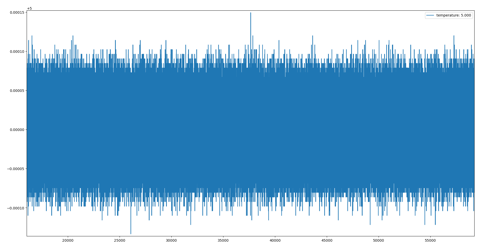

# PID Tuning

## Note on hardware setup

The heat sinking side of the TEC module should be thermally bonded to a large heat-sinking thermal mass to ensure maximum temperature stability, a large optical table had provided good results in tests.

The thermal load under control should be well insulated from the surrounding for maximum stability, closed cell foam had been tested showing good results.

## Real time plot

When tuning Thermostat PID parameters, it is helpful to view the temperature, PID output and other data in the form of a real time graph.

To use the Python real-time plotting utility, run

```shell
python pytec/plot.py
```


## Temperature Setpoints and Thermal Load

A PID controller with the same set of PID parameters may not work identically across all temperatures, especially when comparing the performance of a TEC module cooling a load versus heating a load. This is due to self ohmic heating of the TEC module aiding efficiency when  heating, but harming efficiency when cooling.

When a PID loop is expected to operate the TEC in both heating and cooling modes, it is important to verify the loop performance in both modes.

For systems expected to operate at a narrow range of temperatures, it is a good idea to tune the PID loop at the temperature region of interest.

The same is also true for controlling loads that are expected to produce heat, e.g. laser cooling blocks. Testing the loop performance across varying amount of thermal load is needed to ensure stability in operation.

## Manual Tuning

Below are some general guidelines for manually tuning PID loops. Note that every system is different, and some of the values mentioned below may not apply to all systems.

1. To start the manual tuning process, set the kp, ki and kd parameters to 0.

2. Begin by increasing kp until the temperature begins to oscillate. Offset between the target temperature and the actual temperature can be ignored for now.

3. Reduce kp by 30%, increase ki until the offset between target and actual temperature is eliminated.

4. Increase kd until the maximum allowable amount of overshoot is observed.

5. Some tweaking will be needed to obtain the desired result, especially when trying to balance between minimizing overshoot and maximizing response speed.

## Auto Tuning

A PID auto tuning utility is provided in the Pytec library. The auto tuning utility drives the the load to a controlled oscillation, observes the ultimate gain and oscillation period and calculates a set of PID parameters.

To run the auto tuning utility, run

```shell
python pytec/autotune.py
```

After some time, the auto tuning utility will output the auto tuning results, below is a sample output

```shell
Ku: 0.7553203471147422
Pu: 75.93899999999977
rule: ziegler-nichols
kp: 0.45319220826884526
Ki: 0.011935690706194357
Kd: 4.301870387965967
rule: tyreus-luyben
kp: 0.3432930977636503
Ki: 0.0020549280832497956
Kd: 4.137825730504864
        .
        .   
        .
```

At the end of the test, the ultimate gain `Ku`, oscillation period `Pu` and a few sets of recommended PID parameters are calculated and displayed.  

Multiple suggested sets of PID parameters based on different calculation rules are displayed. While all sets are expected to work, the different sets trade off response time with overshoot differently, and testing is needed to see which set works best for the system on hand.

With a well designed and constructed setup, the PID parameters calculated by the auto tune utility together with some manual tweaking can yield sub-mK control stability.

Below shows data captured on an experiment setup, with 300uK stability over 12 hours.


